# Class 6 In-Class Lab
## Advanced Excel - Pivot Tables, Filtering, IF Functions

### Goal of Today's Lab

This lab is designed to teach you to work with Open Data -- that is, data made available on the web -- while teaching you to use filters and pivot tables in Excel to do more sophisticated analysis and calculate summary statistics.  

This lab uses publicly available data from [Baltimore’s open data portal](https://data.baltimorecity.gov/) to look at crime statistics in Baltimore City from 2014 through 2016. Specifically, we will break down the data in [Open Baltimore's Victim Based Crime database](https://data.baltimorecity.gov/Public-Safety/BPD-Part-1-Victim-Based-Crime-Data/wsfq-mvij) to see how crime rates changed in the wake of [Freddie Gray's death](https://en.wikipedia.org/wiki/Death_of_Freddie_Gray) in 2015.

### How to Submit

You will submit the edited Excel file that you create during the lab on the [ELMS page for this lab](https://umd.instructure.com/courses/1251920/assignments/4734555?module_item_id=9336699).  

You will also submit a text file with notes you are asked to create at certain points.  These don't need to be in story form, I just want to see your thinking. Pretend you are sending a short email to your editor with your findings, to convince them you've found the seed of a story worth pursuing.  

### Step 1: Review the source data

Open the dataset ["BPD Part 1 Victim Based Crime"](https://data.baltimorecity.gov/Public-Safety/BPD-Part-1-Victim-Based-Crime-Data/wsfq-mvij).

Review the summary at the top of the page and the record layout, to get a sense of the fields.  This dataset contains one record per reported "Part 1" crimes -- the most serious crimes -- in the city.  For a breakdown of Part 1 crimes, see [this guide from the FBI](https://www.ucrdatatool.gov/offenses.cfm).

Click the blue "View Data" button to open the data set.

This will load a table with the data.

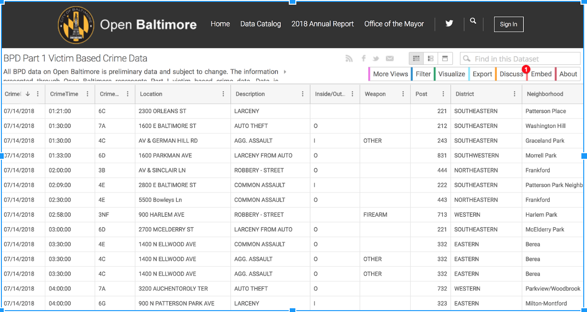  

### Step 2: Filter the source data

Click the “Filter” button and select “Add new filter condition”

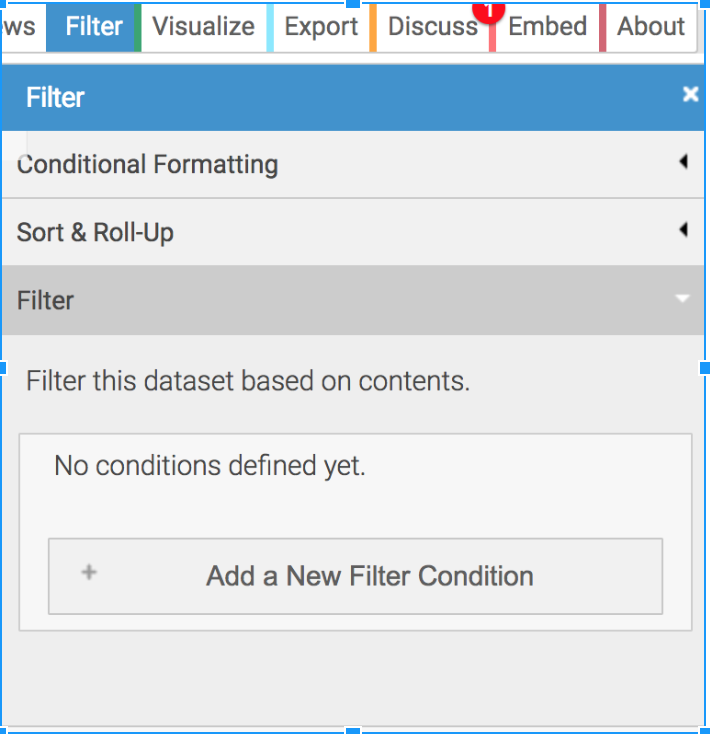    

The default condition will be “Crime date is.”

Select the dropdown arrow next to the word “is” and change it to “is between”

Two text boxes appear where we can define our starting and ending data.

Enter “1/1/2014” in the top box and “12/21/2016” in the second box.

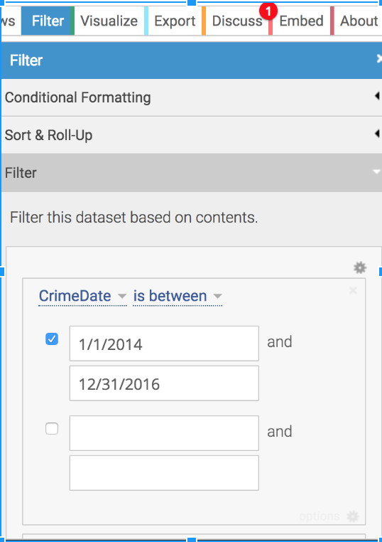    

There are many filtering options available here, allowing you to drill down to specific parts of the data. This is useful since there are hundreds of thousands of incidents listed in this database.

Filtering allows us to find the data we want and create a more manageable dataset. We will also review filtering in Excel later in this exercise.

### Step 3: Download the data

Click the “Export” button.

A popup box will appear with a number of export format options. Select “CSV” -- which stands for Comma Separated Value, a common data format -- and the download will automatically start.

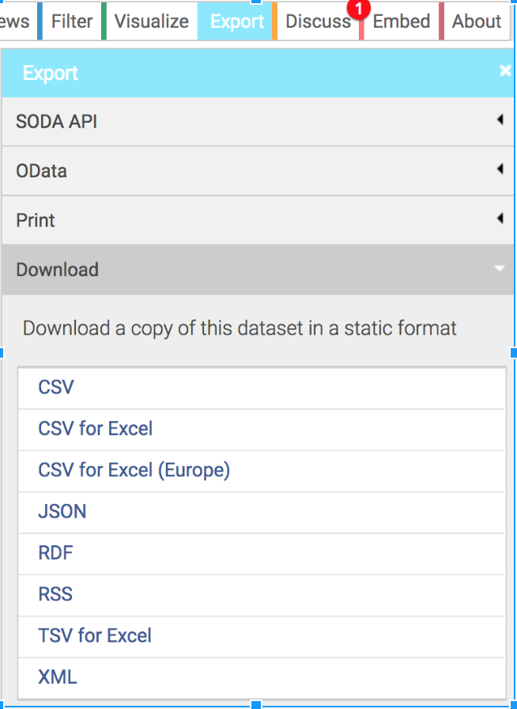    

Move it from your downloads folder to your desktop.

### Step 4: Open the data in Excel

Find the file on your desktop and double click it to open in Excel.

Review the columns in the dataset.  Compare the field names to your documentation. As you review, ask yourself:   

* Are there fields that you don’t understand?
* Do you see any obvious problems with how the values in some of the fields are stored (hint, take a look at first few rows of CrimeTime)?
A: there's some inconsistent coding in how times are coded. 22:31:00 vs 2231
* Are there fields that might allow you to map this data?
Location, District, Neighborhood, Longitude, Latitude, Location

### Step 5: Setup the Spreadsheet

Set up the spreadsheet as instructed previously.

1. Save a new copy to preserve the original data.
2. On the far left of the sheet, add a sequence column of consecutive numbers to allow you to return to the original sort order.
3. Freeze panes to make the column header row "sticky" as you scroll down.
4. Add a "source" tab, and link to the original source of the data.

### Step 6: Working with Pivot Tables

Pivot Tables are a powerful tool in Excel.  They allow you to create a new table summarizing a large data set.  Once you get the hang of them, they are an excellent tool to quickly analyze large data sets.

First, we will create a pivot table to calculate the total number of crimes in each description category (i.e. assault, robbery) in each year (2014, 2015 and 2016).

Follow these steps to start.

* Select any cell in your data
* Hit COMMAND-A on the keyboard. This will select all of the data.
* Select the "Insert" tab and then click "PivotTable"

    

A popup will appear.

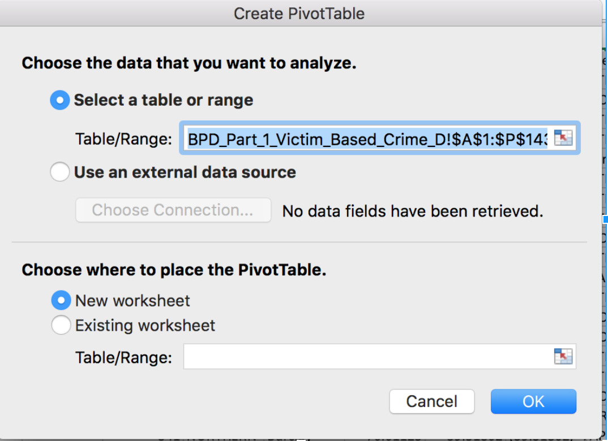    

Click "OK".  In the future, you may choose to adjust these settings.  For now, the defaults are fine.

A new tab will open, where you will build your pivot table. On the right side of the screen, a window shows your options for building the table.

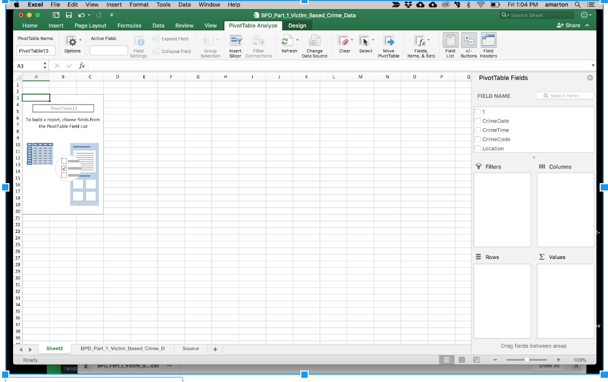

All of the column names from your original data set will display in the “Field Name” window.

Below you will see options for Filters, Rows, Columns and Values. We can drag column names from the "Field Name" window into these windows to create statistical summaries of our data.

Let's build one now.  

* Drag the Description column name into the Rows window.
* Drag Incidents column name into the Value window.

Doing that will create a new table with two columns.  

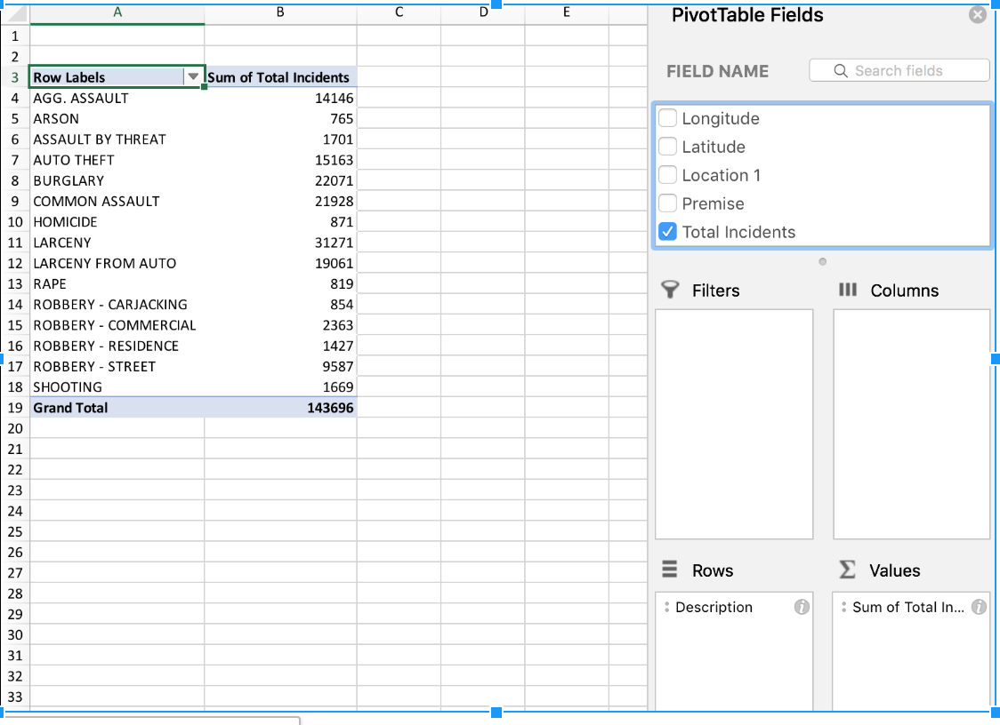

In the left column, there's one row for each crime type. The right column is a sum of the total of number of incidents for each crime type. Because each crime is a separate incident, the only value in the Total Incidents column is 1. That means this pivot table is really a count of records for each crime type.  

We've "grouped" them together, then counted how many we have in each category.

To sort the pivot table, click on the dropdown arrow next to Row Labels.

From the popup window, select Sort by: Sum of Total Incidents and Ascending.

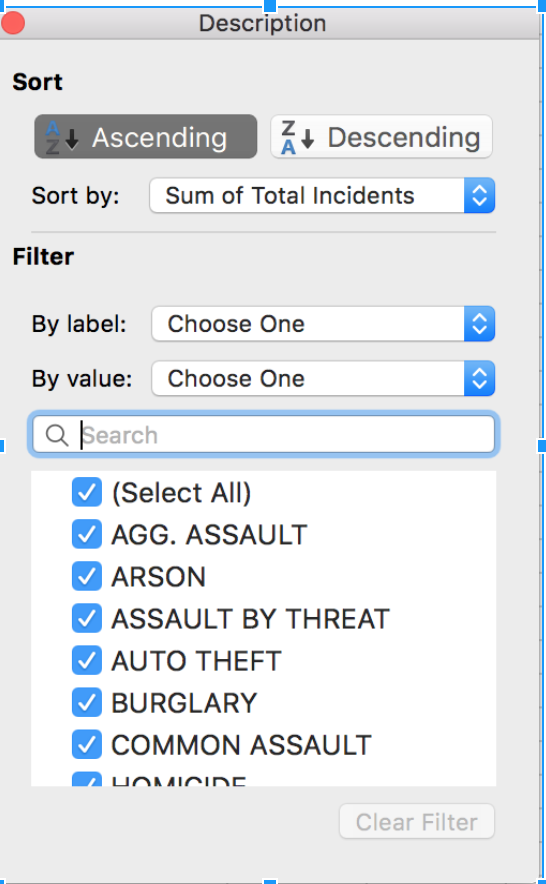

Next, let’s break down the totals for each crime category by year.

But before we do that, we'll have to go back to our original spreadsheet and add a new column.

Insert a new blank column between CrimeDate and CrimeTime, called CrimeYear.

Input the simple function that will allow you to calculate the year from a given date. This [Google search](https://www.google.com/search?q=how+to+calculate+year+from+date+in+excel&rlz=1C5CHFA_enUS761US761&oq=how+to+calculate+year+from+&aqs=chrome.0.0j69i57j0l4.9533j0j7&sourceid=chrome&ie=UTF-8) will get you started.  Fill it down to populate the entire column.

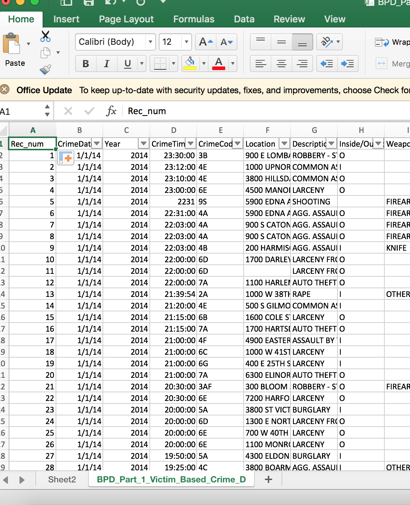

Now go back to your Pivot Table sheet.

Click the "Refresh" button so that your newly created column is available to use in your Pivot Table.

Then click the "Field List" button to bring up the Pivot Table control panel.

Drag the "Year" field name into the Column window.

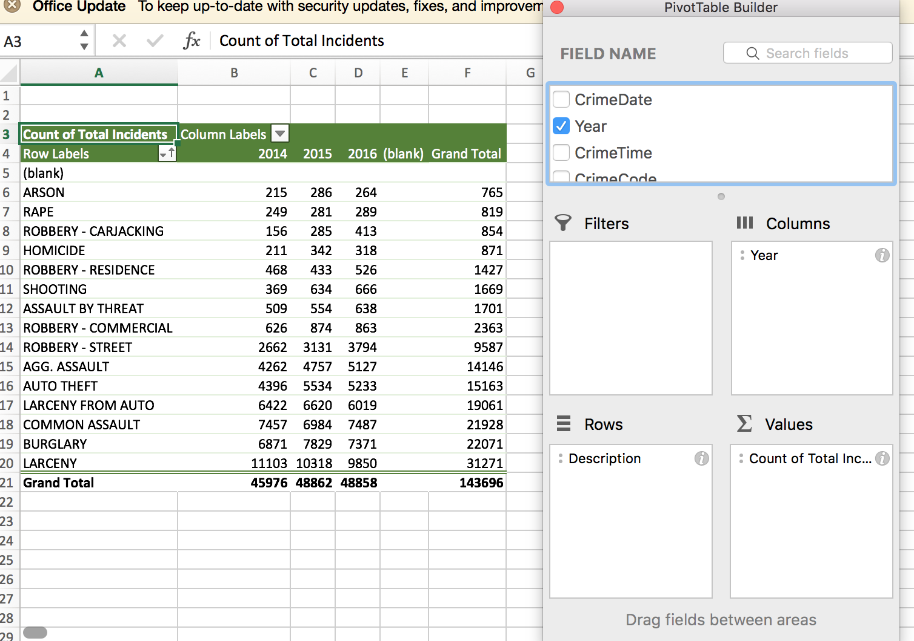

Now we have a breakdown of crime type by year, which really allows us to see year-over-year trends.

Take a second to make some notes thinking of these questions:

* Did crime change much between 2014 and 2015? What about 2015 and 2016?

Yes. An overall 6 percent increase between 14 and 15.  No change between 15 and 16.

* Were the changes for certain crimes more dramatic than others?
Looking at changes between 14 and 16, huge increases in carjacking (165 percent), shooting (80 percent).  There were pretty substantial jumps in many other categories.

* What sort of formulas would you write to quantify the change, allowing you to compare across crime categories with different raw numbers? (copy the pivot table into a new sheet to try adding some).

Some good ones: change and percent change; share of total; rank.

### Step 7: Pivot Table Practice.

On your own, build a brand new pivot table in a new sheet. The first column should be a list of crimes, just as before.  

But instead of years, this time examine totals in the different city police districts, one column per district.

Take some notes, thinking of these questions:

* Is each crime evenly distributed in each district?
No. There's pretty broad variation in specific crimes in specific districts, both in terms of raw numbers and in terms of proportion.
* Which crimes are more pronounced in which districts?
Shootings are overrepresented in the Western and Eastern, for example.
* Just using the information here, is it fair to compare crime totals in one district to crime totals in another district? Why or why not?
Comparing raw numbers is difficult, because, just from this information, it's hard to know whether or not districts have the same size population or geographic area, or other demographic factors that might explain these differences.

Now, let's build on this pivot table by adding the Years field under the Column window, with police districts.

What does this pivot table look like?  As you review it, take notes:

* Were there certain districts where there were bigger changes between 2014, 2015 and 2016?  Which ones?  Can you make an educated guess as to why?
There was an especially large jump in the Southern district in total crimes.
* Were there certain districts where there were big changes in specific crimes worth noting?
Big jumps in shootings in several districts.
* What sort of formulas would you want to write to make apples-to-apples comparisons across districts?

Before moving on, what happens to the structure of the pivot table if you move the year from the Column window to the Rows window?

### Step 8: Filtering

We've already used filters when exporting the data from Open Baltimore. Now we're going to do it in Excel.

Excel allows you to apply filters to selectively see some of the records in your data set.

We will use filter to accomplish two things in this lab:

* View only violent crime incidents in the data

* View only incidents that occurred within two years (one year before and one year after) of the unrest that followed Freddie Gray's death in April 2015.

First, we have to turn on "Filters".

Go to the "Data" tab and select Filter.

A drop-down arrow appears next to each field name in the spreadsheet.

First, let’s use filtering to view only violent crimes. Violent crimes include all categories of assault, homicide, rape, robbery and shooting. They exclude crimes like arson, auto theft and burglary.

“In the FBI’s Uniform Crime Reporting (UCR) Program, violent crime is composed of four offenses: murder and nonnegligent manslaughter, forcible rape, robbery, and aggravated assault. Violent crimes are defined in the UCR Program as those offenses which involve force or threat of force.”

Click on the arrow next to “Description” in the top row of the spreadsheet.

Use the checkboxes to display only the following crimes:
AGG. ASSAULT, COMMON ASSAULT, HOMICIDE, RAPE, ROBBERY - CARJACKING, ROBBERY - COMMERCIAL, ROBBERY - RESIDENCE, ROBBERY - STREET, SHOOTING.

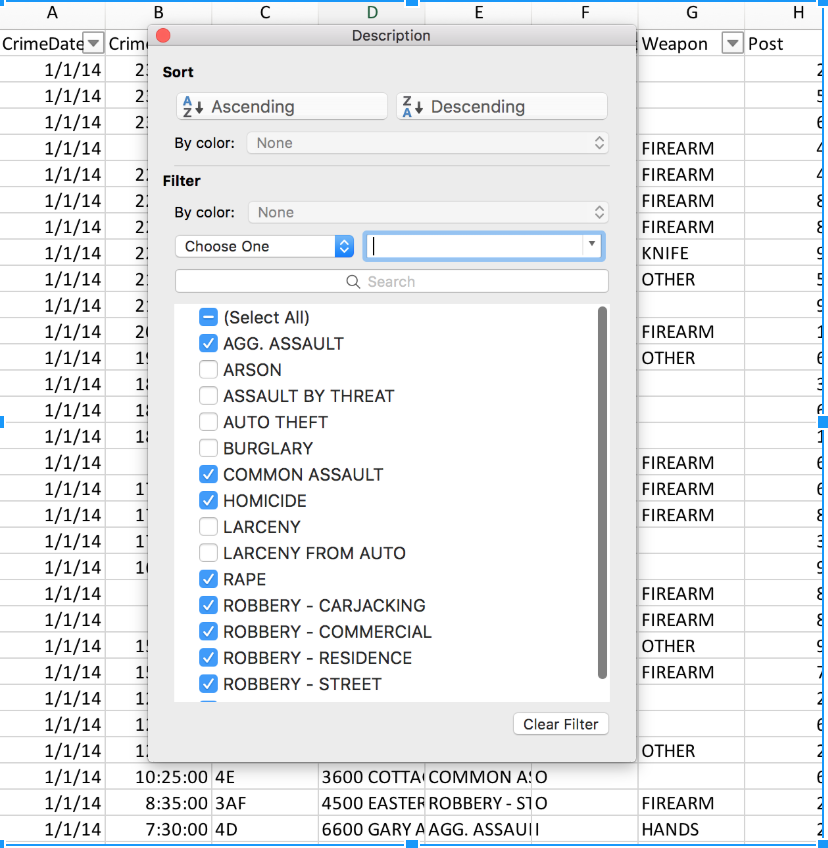

Now we will only see incidents that match the checked descriptions. This will allow us to analyze the most serious and violent crimes only in Baltimore-- including homicide, rape and carjacking.

Notice the row numbers on the far right are a different color, and some are missing.  That's because the rows that don't match our filter are hidden.

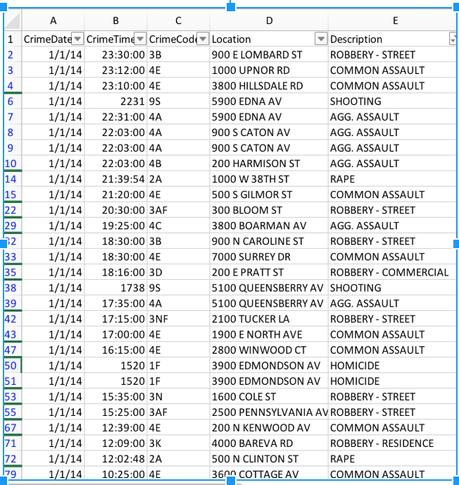

Let’s go ahead and clear that filter.

To do so, click the arrow next to “Description” and select the “Clear Filter” button from the popup.

Next, we will filter for date. We will isolate incidents that happened within one year (before and after) of the unrest around Freddie Gray's death, using April 27, 2015 as our date (though the protesting and eventual unrest extended for several days, this is considered the first day of major civil unrest and violence).

Select a cell within the dataset.

Go to the Data tab and select Filter.

You will now see that drop-down arrows have appeared next to each field name.

Select the arrow next to “CrimeDate” in the top row of the spreadsheet.

Filter for dates within two years of the riots; 4/27/2014 - 4/27/2016; using the “Between” function in the filter popup box.

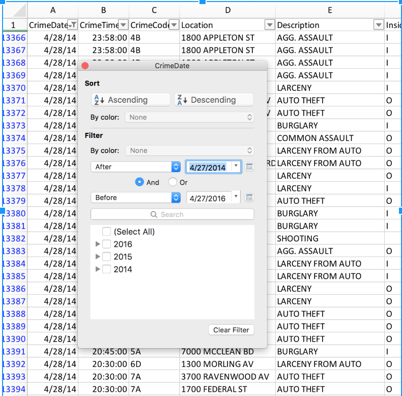

Before going any further, turn off filters.

# Step 9: Introduction to IF functions

We're going to use a new kind of function -- an IF function -- to summarize our data.  

IF functions are logical tests.  You feed use an IF function to ask a true/false question.  If the answer is true, it spits out one thing. If the answer is false, it spits out another.

In this case, we're going to use an IF function to create a new column to instantly tell us whether a crime happened before April 27, 2015 or after.  This will allow for easier comparisons between the two periods later.  

Create a new column called “Before/ after unrest”

In the second row of that column write this formula:

=IF(B2>DATE(2015,4,27), "After", "Before")

This says “If the date in cell B2 is later than April 28, 2015 then add the word “After” in the cell. Otherwise, add the word “Before.”

# Step 10: More practice with IF functions

Next we will use an IF function to mark if a crime was a robbery or not.

Since there are several categories of robberies, this will allow us to look at all robberies as a whole.

Create a new column called “Robbery”

In row 2 of that column, type the following”

=IF(OR(F2="ROBBERY - CARJACKING",F2="ROBBERY - COMMERCIAL",F2="ROBBERY - RESIDENCE",F2="ROBBERY - STREET"),"ROBBERY","NOT ROBBERY")

This says “If the cell F2 contains any of the robbery categories, then add the word “Robbery” in the cell. Otherwise, add the words “Not robbery.”

Note that it uses the OR function nested within an IF function, also a new one for us. OR allows us to neatly package several different types of robberies in one list.  

Now, on your own, create a new column called "Assault".  Write an IF function that performs similarly to the one you just created for robberies, to classify a crime is a type of assault or not.
AGG. ASSAULT
ASSAULT BY THREAT
COMMON ASSAULT

# Step 11: Submit your work

Submit your edited Excel file and your notes file on the [ELMS page for this lab](https://umd.instructure.com/courses/1251920/assignments/4734555?module_item_id=9336699).
